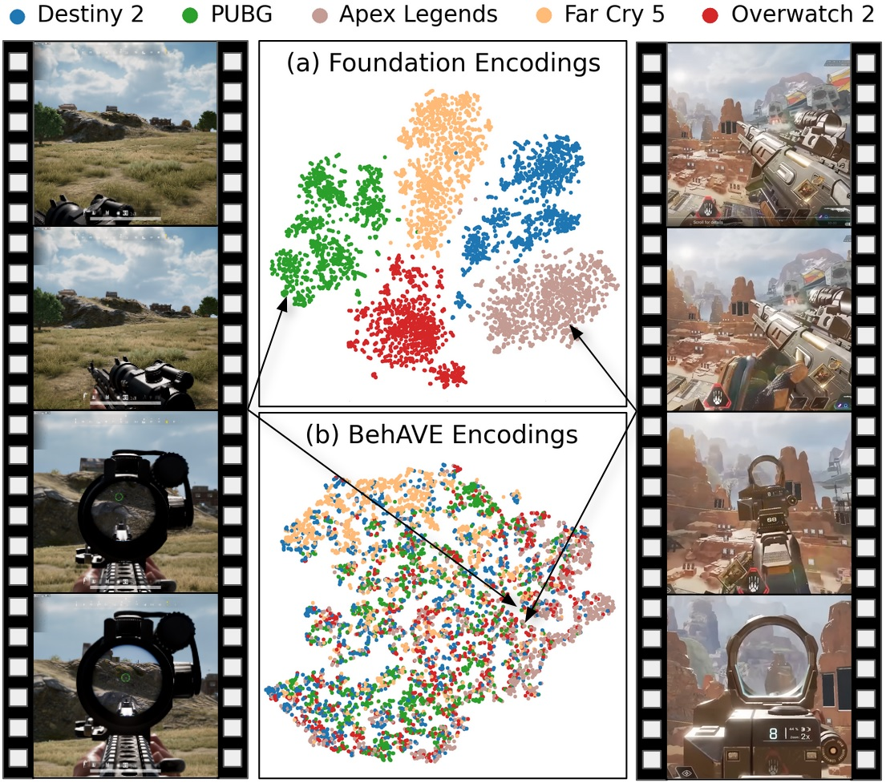
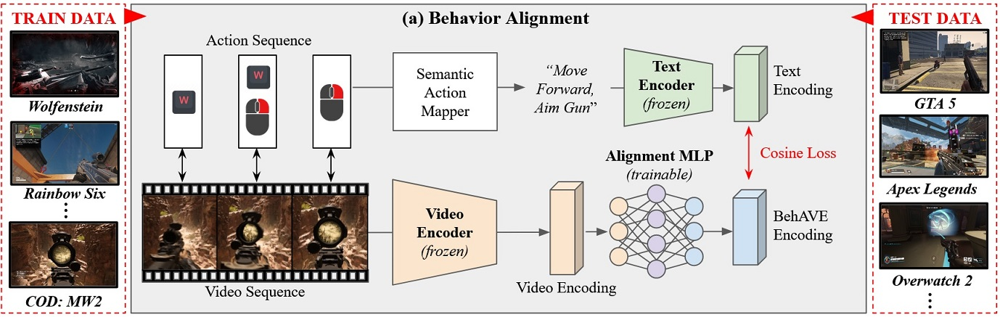

# BehAVE: Behaviour Alignment of Video Game Encodings (
**Paper:** https://arxiv.org/abs/2402.01335

**Dataset:** https://drive.google.com/drive/folders/1K4BiOSHa8nHQPm4T2guB8AVF-y3H85ZQ

Additional code and links to our dataset will be updated shortly.

## Contents

1. [Code Overview](#code-overview)
2. [Datasets](#datasets)
3. [License](#license)
4. [Maintenance](#maintenance)

## Code Overview

Brief overview of each script's purpose.

- `gather_gameplay_data.py` - Used for collecting data, by capturing screen and input devices (mouse, keyboard).
- `dataset.py` - Implementation of PyTorch dataset that prepares data for training.)
- `model.py` - PyTorch implementation of the projection module of our BehAVE framework.)
- `train.py` - Training script. All training related parameters are contained within it.)

## Datasets

We are currently in the process of hosting data collected for this project. Links and descriptions will be updated shortly.
We provide links to project pages for other datasets we use as they are the property of their respective authors, and fall under licences and terms they define.
- [CS:GO](https://github.com/TeaPearce/Counter-Strike_Behavioural_Cloning)
- [Minecraft](https://github.com/openai/Video-Pre-Training)

## Requirements

### Python and OS requirements
All code was tested on machines running Windows 10 and Python 3.10. For specific Python and library versions please refer to `requirements.txt` file (will be added shortly).

## License
This repository can be used for personal projects and open-sourced research. Commercial use in any form is not permitted.

## Maintenance
This repository contains code utilized for academic research and is not intended for production use. 
There are no current plans to actively update and maintain the repository.

